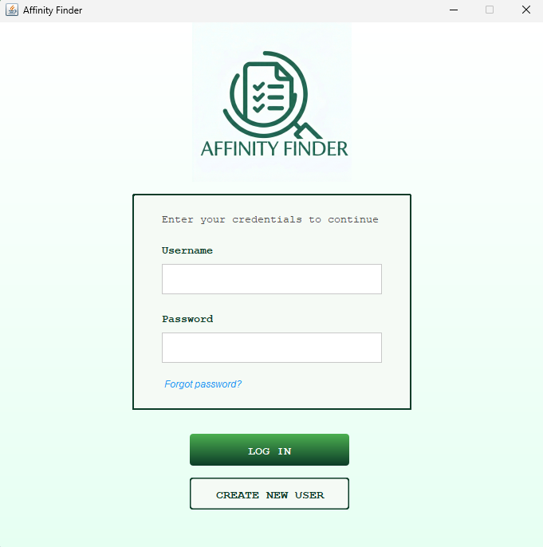
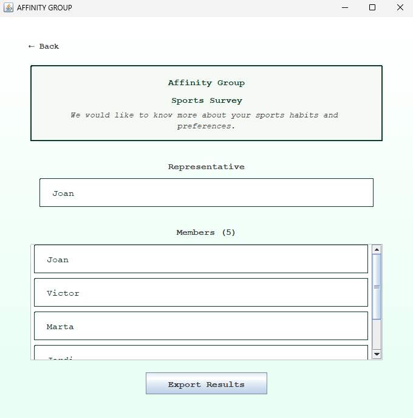
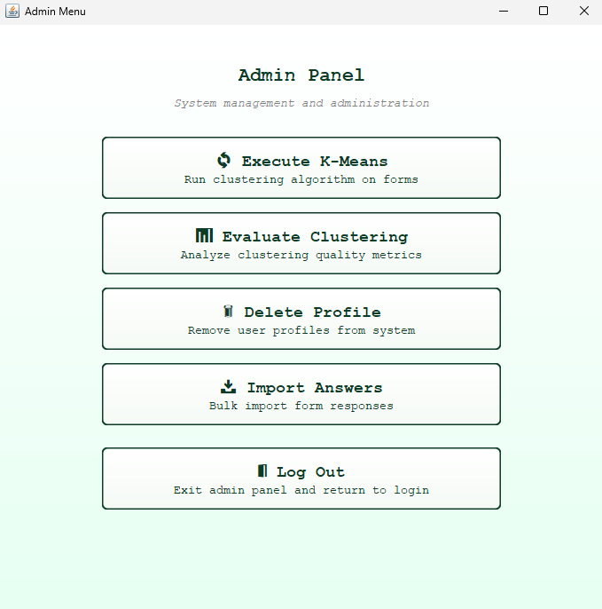
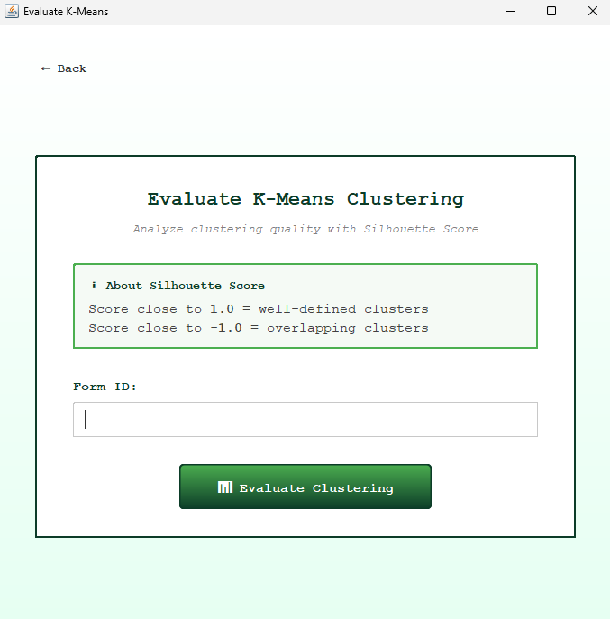

# Affinity Finder - Clustering

> A sophisticated Java desktop application that uses K-means clustering to discover and visualize user affinity groups based on survey responses.


## 🎓 Academic Project

This is a final project for the **PROP (Projectes de Programació)** course at **UPC (Universitat Politècnica de Catalunya)**. It demonstrates advanced software engineering principles including clean architecture, design patterns, and algorithmic optimization.

---

## Overview

**Affinity Finder** intelligently groups survey respondents into clusters of similar users based on their answer patterns. This sophisticated clustering engine employs the K-means algorithm with automatic parameter optimization, PCA-based visualization, and robust evaluation metrics—all wrapped in an intuitive, professional GUI.

Perfect for:
- 🎯 Market research and customer segmentation
- 👥 User behavior analysis
- 📊 Data-driven decision making
- 🔬 Clustering research and experimentation

## 🎬 Demo & Visual Gallery

### Demo Video

<div align="center">

**Watch Affinity Finder in action**

<video src="https://github.com/alexmanzaneda/affinity-finder-clustering/raw/refs/heads/main/DOCS/media/affinity_demo.mp4" width="640" controls="controls" style="max-width: 100%;"></video>


*Features: User authentication • Profile Menu • View Affinity Groups • Create Forms*

</div>

---

### Screenshots

Experience the intuitive interface of Affinity Finder:

<table>
  <tr>
    <td align="center">
      <strong>User Authentication</strong><br>
      <br>
      Secure login and registration system
    </td>
    <td align="center">
      <strong>User Profile</strong><br>
      <br>
      View affinity groups and user details
    </td>
  </tr>
  <tr>
    <td align="center">
      <strong>Admin Dashboard</strong><br>
      <br>
      Complete administrative control panel
    </td>
    <td align="center">
      <strong>K-Means Evaluation</strong><br>
      <br>
      Evaluate and optimize clustering results
    </td>
  </tr>
</table>


## Key Features

### 🎯 Advanced Clustering Engine
- **K-means Implementation** with configurable cluster count
- **Elbow Method** for automatic optimal K detection
- **Silhouette Score** evaluation for cluster quality assessment
- Distance-based centroid assignment with iterative optimization

### 📈 Data Visualization
- **Interactive Scatter Plots** using PCA decomposition for dimensionality reduction
- **3D Visualization Support** with Jzy3d
- Real-time cluster visualization and analysis
- Eigenvalue-based PCA for multi-dimensional data representation

### 📋 Form & Survey Management
- Create custom forms with multiple question types
- Import/export forms and answer data
- Manage user profiles and responses
- Track respondent metadata

### 💾 Robust Data Persistence
- JSON-based data storage
- Profile management with unique identifiers
- Answer history tracking
- Cluster result persistence

### 🎨 Professional Desktop UI
- Built with Swing for responsive interface
- Form creation and editing workflows
- Affinity group visualization and exploration
- User-friendly profile management


## Technology Stack

```
Backend:
├─ Java 21 (JVM)
├─ K-means Clustering Algorithm (custom)
├─ Apache Commons Math (linear algebra)
├─ Apache OpenNLP (NLP capabilities)
│
Frontend:
├─ Swing (GUI framework)
├─ JavaFX (enhanced graphics)
└─ Jzy3d (3D visualization)

Data:
├─ GSON (JSON serialization)
└─ JSON (persistent storage)

Build:
└─ Gradle (build automation)
```

## Architecture

The project follows a clean **three-layer architecture**:

```
presentation/
├─ controllers/     (UI orchestration)
├─ classes/        (View components)
│  ├─ form/
│  ├─ affinity/
│  └─ ...
└─ resources/

domain/
├─ controllers/    (Business logic)
├─ classes/       (Domain models)
│  ├─ Form
│  ├─ Answer
│  ├─ AffinityGroup
│  ├─ Kmeans
│  └─ ScatterChart
└─ exceptions/

persistence/
├─ AnswerPersistence
├─ FormPersistence
├─ ProfilePersistence
└─ PersistenceManager
```

### Architecture Diagrams

For a detailed understanding of the system design, comprehensive UML diagrams are available:

| Diagram | Description |
|---------|-------------|
| [Domain Diagram](DOCS/diagrams/Domain_Diagram.svg) | Core business entities and domain models |
| [Persistence Diagram](DOCS/diagrams/Persistence_Diagram.svg) | Data storage and persistence layer |
| [Presentation Diagram](DOCS/diagrams/Presentation_Diagram.svg) | UI components and view controllers |
| [Use Case Diagram](DOCS/diagrams/UseCaseDiagram.svg) | System interactions and user workflows |

---

## Getting Started

### Prerequisites
- Java 21 JDK or higher
- Gradle 8.0+
- Windows/Linux/macOS

### Installation

1. **Clone the repository**
   ```bash
   git clone https://github.com/yourusername/affinity-finder-clustering.git
   cd affinity-finder-clustering
   ```

2. **Build the project**
   ```bash
   cd FONTS
   ./gradlew build
   ```
   On Windows:
   ```bash
   cd FONTS
   gradlew.bat build
   ```

3. **Run the application**
   ```bash
   ./gradlew run
   ```
   Or using the provided scripts:
   ```bash
   cd EXE
   ./run.sh      # Linux/macOS
   run.bat       # Windows
   ```

### Quick Start Workflow

1. **Create a Profile** - Register as a user in the system
2. **Create or Import Forms** - Build surveys with custom questions
3. **Answer Forms** - Respond to survey questions
4. **Run Clustering** - Execute K-means algorithm on responses
5. **View Results** - Explore affinity groups and visualizations
6. **Analyze Clusters** - Review cluster quality metrics


## Project Highlights

### Code Quality
- ✅ Clean architecture with separation of concerns
- ✅ Comprehensive error handling with custom exceptions
- ✅ Fully documented with Javadoc
- ✅ Consistent naming conventions
- ✅ Modular component design

### Algorithmic Excellence
- 🔬 Efficient K-means implementation with convergence optimization
- 📊 Silhouette score evaluation for cluster validation
- 🧮 Advanced distance metrics for multi-dimensional data
- 🎯 Elbow method for automatic parameter tuning

### User Experience
- 🖥️ Intuitive GUI workflows
- 📈 Real-time visualizations
- 💡 Clear progress indicators
- ⚠️ Informative error messages

## Data

The application includes mock data for testing:

```
EXE/data/
├─ profiles/       (User profiles)
├─ forms/          (Survey templates)
└─ answers/        (User responses)
```


## Evaluation Metrics

The application provides multiple clustering quality metrics:

- **Silhouette Score** (-1.0 to 1.0): Measures cluster cohesion and separation
- **Within-Cluster Sum of Squares (WCSS)**: Evaluates cluster compactness
- **Elbow Method**: Automatically determines optimal cluster count


## Team

This project was developed as a collaborative effort:

- **Alex Manzaneda**  -  [](https://github.com/alexmanzaneda)

- **Sara Vidal**  -  [](https://github.com/saravigon)

- **Edu Hernandez**  -  [](https://github.com/eduuhernaandez)

- **Oriol Valencia**  -  [](https://github.com/oriolvalencia1)

---

<div align="center">

**If this project helped you, please consider giving it a ⭐**

</div>
